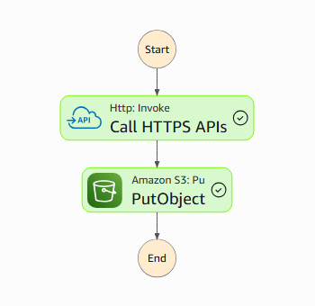
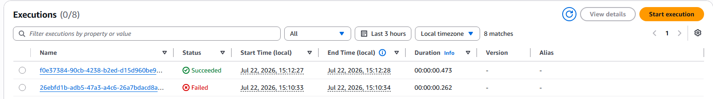
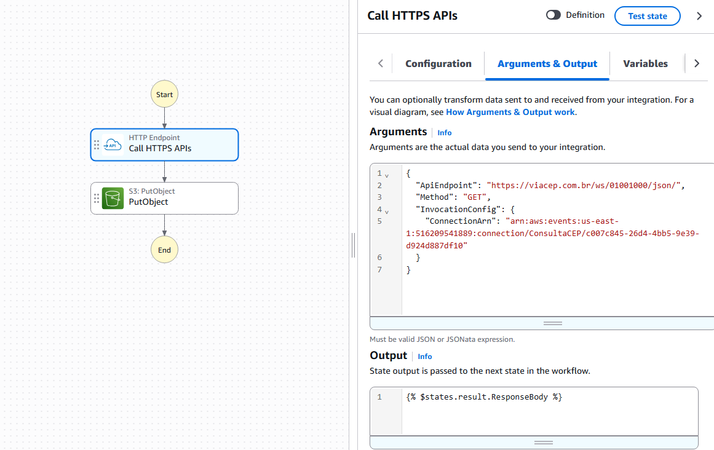
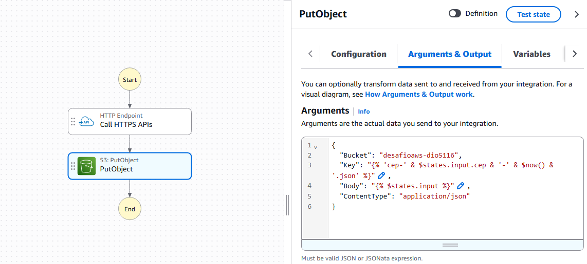
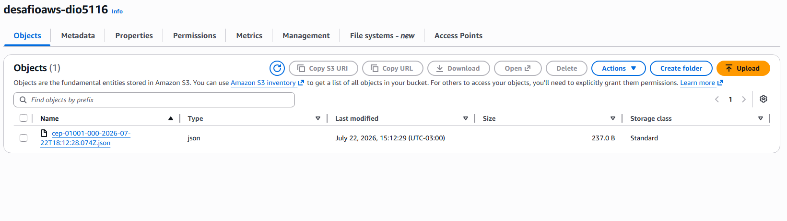
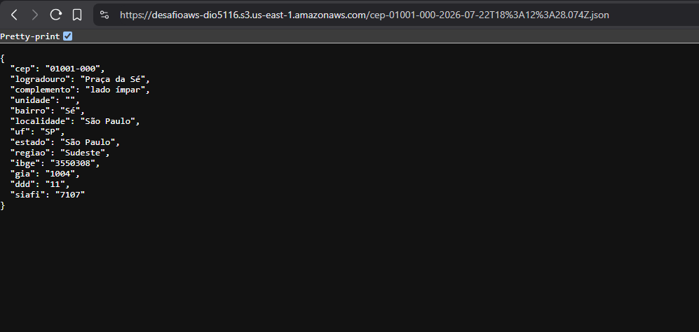

# bootcamp-aws

## 2ª Desafio
Aplicar os conhecimentos das aulas sobre [AWS Step Functions](https://aws.amazon.com/pt/step-functions/) e documentar no GitHub.

### Resolução
Para fazer o desafio eu criei um Step Function simples que faz um GET request para [API Via CEP](https://viacep.com.br/), passado o CEP `01001000` e então guardando o resultado em um arquivo JSON em um S3 bucket.

Foi um pouco desafiador fazer minha primeira Step Function, mas com algumas interações e com ajuda da ferramenta do Amazon Q eu consegui fazer com que funcionasse como desejado.

Alguns desafios foram configurar corretamente o EventBridge Connection utilizado para fazer o request na API, e ajustar a política para fazer um PUT Object no S3 bucket, além de configurar corretamente os argumentos nas step functions para utilizar corretamente as variáveis necessarias.

#### Argumentos para o endpoint

#### Argumentos para fazer o PUT no S3 bucket

#### Arquivo criado no S3

#### JSON criado
