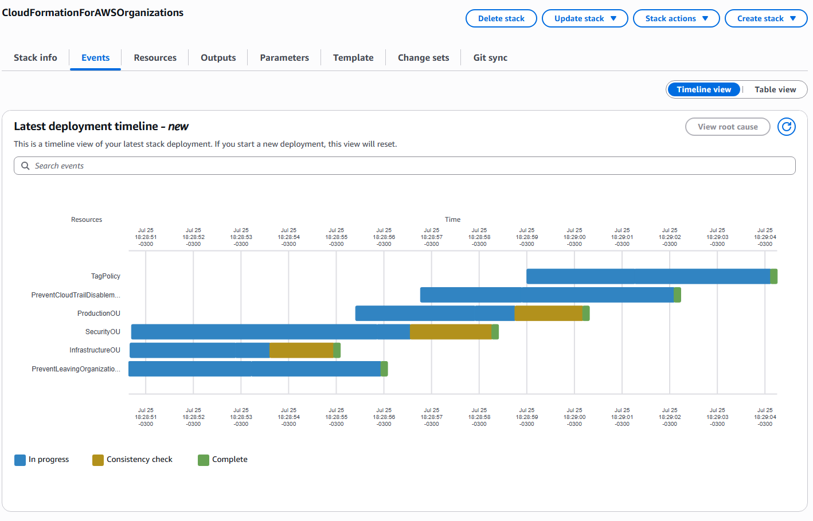
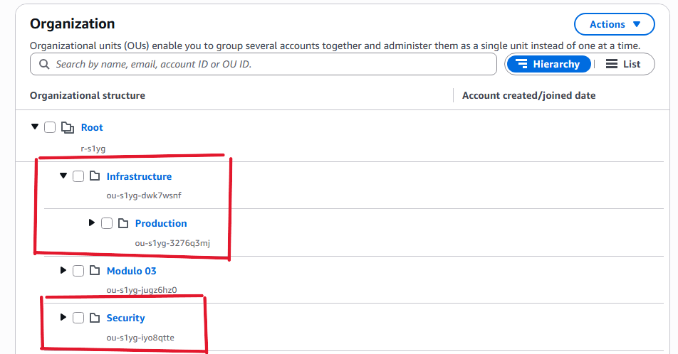

# bootcamp-aws

## 4º Desafio
Implementar uma infraestrutura automatizada com AWS CloudFormation.

Para esse desafio vou usar o Cloudfront para automatizar a criação de recursos no AWS Organizations.
Para isso vou seguir esse [artigo](https://aws.amazon.com/blogs/security/deploy-aws-organizations-resources-by-using-cloudformation/).

Inicialmente é necessário criar um novo role para o Cloudformation usando a seguinte [permission policy](./files/permissions-policy.json) e [trust policy](./files/trust-policy.json).

Na AWS Organizations foi preciso habilitar Tag Policies e Service control policies.

Após alguns erros e com a ajuda do Amazon Q eu consegui criar a stack com sucesso.

As seguintes Organizational Units (OUs) foram criadas.

A unica diferença do artigo foi que seria criado uma conta dentro da OU Production, mas eu já tinha atingido o limite de contas das AWS e não foi possível criar uma conta para esse exemplo.