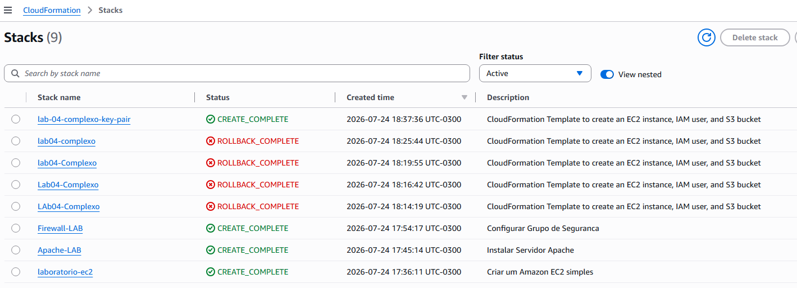
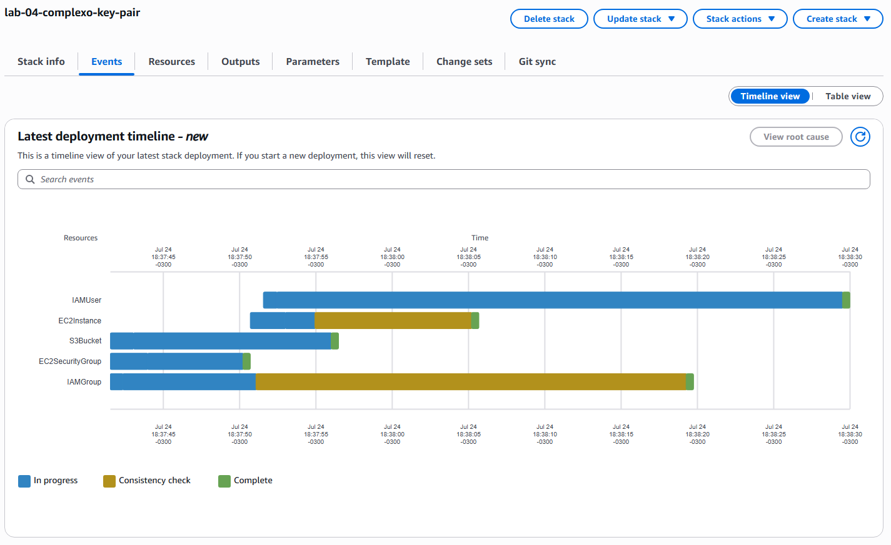
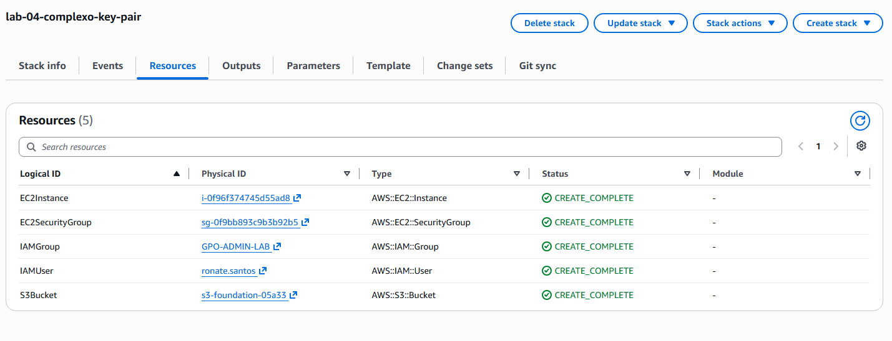

# bootcamp-aws

## 3º Desafio

Implementar uma Stack com AWS CloudFormation.

Nesse desafio eu utilizei os templates fornecidos pelo professor que criam 4 instâncias EC2, o primeiro template cria uma EC2 simples, o segundo cria uma EC2 e instala o Apache, o terceiro faz o mesmo que o segundo e adiciona um firewall usando o Security Group, e o quarto template cria uma instância EC2 um usuário IAM e um S3 bucket.

Não encontrei dificuldades para usar o AWS Cloudformation, porém houve alguns problemas pequenos ao rodar o ultimo template, como não ser aceito nome de bucket com letra maiuscula e AMIs do Ubuntu desatualizadas, que eu peguei desse [site](https://cloud-images.ubuntu.com/locator/ec2/).

#### Stacks criadas

#### Conclusão com sucesso da ultima stack

#### Recursos criados pela ultima stack

