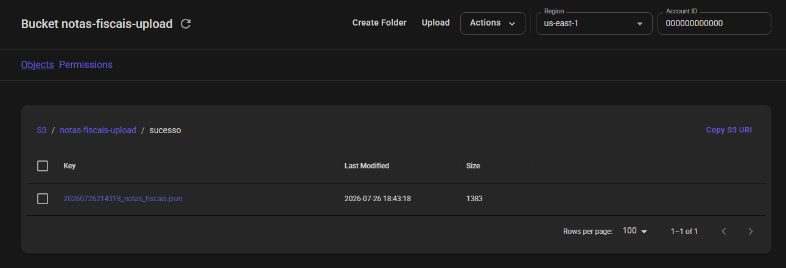
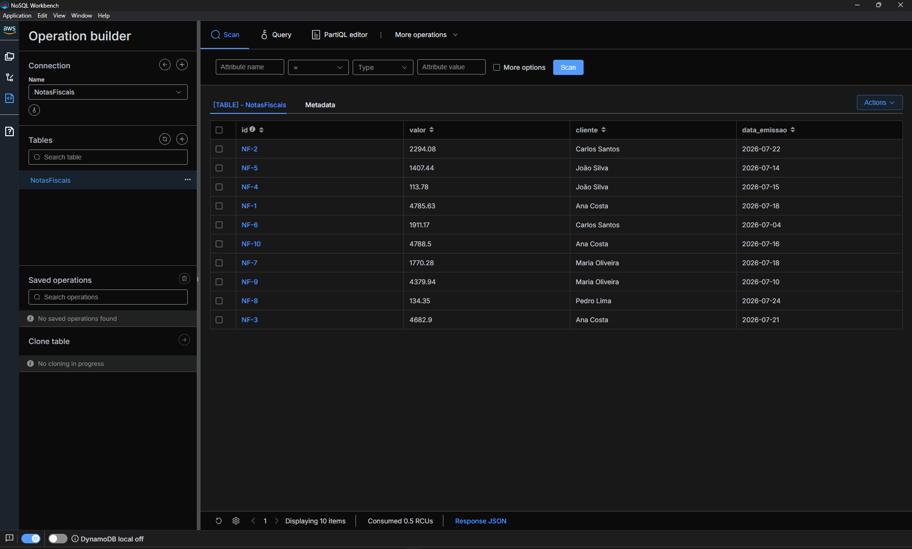

# bootcamp-aws

## 5º Desafio
Consolidar conhecimentos em tarefas automatizadas com Lambda Function e S3

Para esse desafio eu segui o exemplo da aula e criei um S3 Bucket e um Lambda Function que transforma um arquivo JSON em entradas em um DynamoDB, tudo localmente utilizando o Localstack.

Utilizei os arquivos .txt fornecidos e copiei os códigos que o professor mostrou em tela, não tive muitos problemas em realizar o desafio, apenas foi trabalhoso copiar o código, houve alguns pequenos erros e com a ajuda e sugestão da Antigravity do Google consegui fazer a implementação correta.

#### Arquivo JSON movido para a pasta sucesso no S3 bucket, após execução correta do Lambda Function

#### Entradas no DynamoDB após execução do Lambda Function
